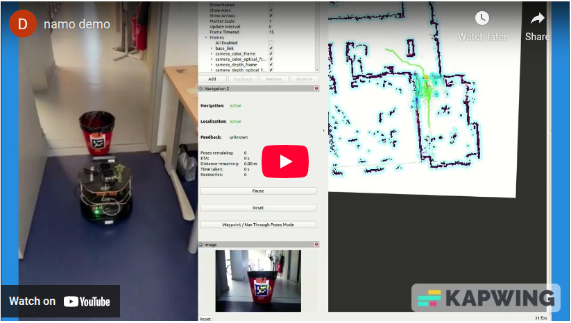
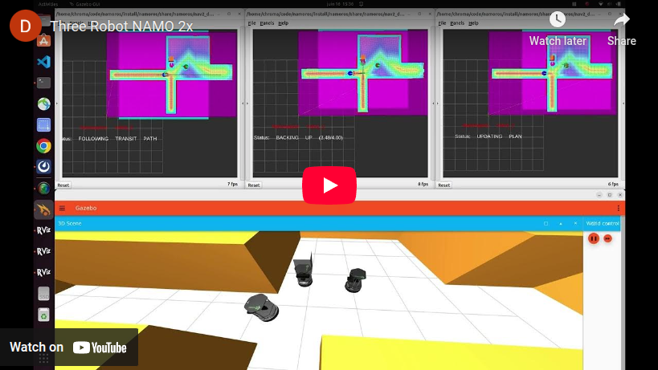

[](https://github.com/Chroma-CITI/namosim/actions/workflows/ci.yml)

# NAMOSIM


NAMOSIM is a robot motion planner designed for the problem of navigation among movable obstacles (NAMO). It simulates mobile robots navigating in 2D polygonal environments in which certain obstacles can be grabbed and relocated. It currently supports **holonomic** and **differential drive** motion models. A variety of agent types are implemented, including primarily our **Stilman2005** baseline agent. New agents utilizing alternative algorithmic approaches can be created and plugged into the planner in a straightforward manner by implementing the **Agent** base class.

## Documentation

Please check out the [docs site](https://chroma-citi.github.io/namosim/) for installation and usage instructions.

To build the docs site locally, run:

```bash
./scripts/make_docs.sh
```

# Demos

Here are a couple demo videos applying namosim on real and simulated robots.

#### NAMOSIM on a Turtlebo

[](https://youtu.be/076ecBfaBTw)


#### NAMOSIM on Multiple Robots in Gazebo

[](https://youtu.be/qgPz69Dk9bc)

## Authors

- Benoit Renault
- Jacques Saraydaryan
- David Brown
- Olivier Simonin

## Affiliated Teams and Organisations

|                                                 | Org/Team                                      |
| ----------------------------------------------- | --------------------------------------------- |
|     | [Inria](https://inria.fr/fr)                  |
|  | [INSA Lyon](https://www.insa-lyon.fr/)        |
|       | [CITI Laboratory](https://www.citi-lab.fr/)   |
| CHROMA                                          | [CHROMA Team](https://www.inria.fr/en/chroma) |

## Cite Us

If you reuse any part of this project in your research, please cite the associated papers:

```bibtex
@inproceedings{renault:hal-04705395,
  TITLE = {{Multi-Robot Navigation among Movable Obstacles: Implicit Coordination to Deal with Conflicts and Deadlocks}},
  AUTHOR = {Renault, Benoit and Saraydaryan, Jacques and Brown, David and Simonin, Olivier},
  URL = {https://hal.science/hal-04705395},
  BOOKTITLE = {{IROS 2024 - IEEE/RSJ International Conference on Intelligent Robots and Systems}},
  ADDRESS = {Abu DHABI, United Arab Emirates},
  PUBLISHER = {{IEEE}},
  PAGES = {1-7},
  YEAR = {2024},
  MONTH = Oct,
  KEYWORDS = {Planning ; Scheduling and Coordination ; Path Planning for Multiple Mobile Robots or Agents ; Multi-Robot Systems},
  PDF = {https://hal.science/hal-04705395v1/file/IROS24_1134_FI.pdf},
  HAL_ID = {hal-04705395},
  HAL_VERSION = {v1},
}
```

```bibtex
@inproceedings{renault:hal-02912925,
  TITLE = {{Modeling a Social Placement Cost to Extend Navigation Among Movable Obstacles (NAMO) Algorithms}},
  AUTHOR = {Renault, Benoit and Saraydaryan, Jacques and Simonin, Olivier},
  URL = {https://hal.archives-ouvertes.fr/hal-02912925},
  BOOKTITLE = {{IROS 2020 - IEEE/RSJ International Conference on Intelligent Robots and Systems}},
  ADDRESS = {Las Vegas, United States},
  SERIES = {2020 IEEE/RSJ International Conference on Intelligent Robots and Systems (IROS) Conference Proceedings},
  PAGES = {11345-11351},
  YEAR = {2020},
  MONTH = Oct,
  DOI = {10.1109/IROS45743.2020.9340892},
  KEYWORDS = {Navigation Among Movable Obstacles (NAMO) ; Socially- Aware Navigation (SAN) ; Path planning ; Simulation},
  PDF = {https://hal.archives-ouvertes.fr/hal-02912925/file/IROS_2020_Camera_Ready.pdf},
  HAL_ID = {hal-02912925},
  HAL_VERSION = {v1},
}
```
