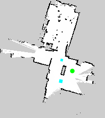

Creating a YAML Scenario
==========================

A YAML scenario allows you to utilize standard ROS grid maps with namosim. It is a bit more complex because it is designed to work with real robots using an image to represent the static map. It is composed of four files:

1. An image file representing the map (usually a .pgm or .png)
2. A map config yaml file
3. An SVG geometry file
4. A NAMO config yaml file

The first two items constitute a standard ROS map, `see here for details <https://wiki.ros.org/map_server>`_.

The SVG file is a bit different in this case. It can have four layers:

1. a `map_layer`
2. a `movables_layer`
3. a `goals_layer`
4. a `robots_layer`

See below for an example.

The NAMO config yaml file provides the link between the SVG and the ROS map.

The Geometry File
-----------------

Here are the contents of a minimal svg geometry file. All geometries in the world must be svg **path**
elements and each must have an **id** attribute which is used by the **<namo_config>** to configure the geometry
as an entity in the simulation.

.. literalinclude:: ../../tests/scenarios/citi_ing/citi_ing.svg
  :language: xml

Here is the same file rendered as an image:

You can see the robot starting position in the top left. To the right of the robot is a movable box. The walls
are in black. The robot goal pose is visible in the bottom right.

We recommend using `Inkscape <https://inkscape.org/>`_ to edit your svg geometry file.

Units
-----

As before, all units in the SVG geometry file be in centimeters. The ROS map should have units in meters.

Namo Config Yaml File
---------------------

The namo config yaml file links the svg to the ros map and provides configuration settings for each robot in the scenario. 
The full specification is defined by the `NamoConfigYamlModel` class which can be found in 
`namosim/data_models.py <https://github.com/Chroma-CITI/namosim/blob/humble/namosim/data_models.py?ref_type=heads>`_.

Example:

.. literalinclude:: ../../tests/scenarios/citi_ing/namo.yaml
  :language: xml