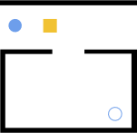
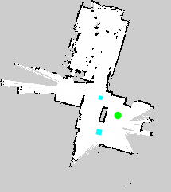

Guides
=============

Creating Custom Scenarios
-------------------------

The NAMO planner supports loading scenarios in one of two ways:

1. From an SVG file
2. From a ROS map

The first method is best when executing purely in simulation, while the second is intended for usage with
real robots.

Creating an SVG Scenario
------------------------

Each Namo scenario is fully contained in a single SVG file.

The Geometry File
~~~~~~~~~~~~~~~~~
Here are the contents of a minimal svg geometry file. All geometries in the world must be svg **path**
elements and each must have an **id** attribute which is used by the **<namo_config>** to configure the geometry
as an entity in the simulation.

.. literalinclude:: ../../tests/scenarios/minimal_stilman_2005.svg
  :language: xml

Here is the same file rendered as an image:

You can see the robot starting position in the top left. To the right of the robot is a movable box. The walls
are in black. The robot goal pose is visible in the bottom right.

We recommend using `Inkscape <https://inkscape.org/>`_ to edit your svg geometry file.

Units
~~~~~~~~~~~~~~~~~
It is essential that all units in your SVG geometry file be in CENTIMETERs. The reasons for this is because, Inkscape
only supports centimeters and not meters. The NAMO planner will convert the units to meters during execution.

The Namo Config
~~~~~~~~~~~~~~~~~
The scenario file must contain a `<namo_config>` element that is a direct child of the root `<svg>` element.
This object configures the simulator and agents and it the place where all agent behavioral parameters are set.

The full specification for the `<namo_config>` is defined by the `NamoConfigModel` class which can be found in 
`namosim/data_models.py <https://gitlab.inria.fr/chroma/namo/namosim/-/blob/dev/namosim/data_models.py?ref_type=heads>`_.

Robots and Navigation Goals
~~~~~~~~~~~~~~~~~~~~~~~~~~~
Each robot and goal listed in the `<namo_config>` must have a corresponding `<svg:path id="[your_agent_id]">` path element somewhere in the svg file. These elements 
provides the shape, position, and orientation of the robots and goals.

.. code-block:: xml
  <svg:path
      d="m 121.17572,125.39975 0,0 c 0,-3.87867 3.14428,-7.02295 7.02295,-7.02295 l 0,0 c 1.8626,0 3.64891,0.73992 4.96597,2.05698 1.31706,1.31705 2.05697,3.10337 2.05697,4.96597 l 0,0 c 0,3.87866 -3.14428,7.02294 -7.02294,7.02294 l 0,0 c -3.87867,0 -7.02295,-3.14428 -7.02295,-7.02294 z"
      id="goal_0"
      angle="90"
      style="fill:none;fill-rule:evenodd;stroke:#1155cc;stroke-linecap:square;stroke-miterlimit:10;stroke-opacity:1"
      inkscape:connector-curvature="0" inkscape:label="#path29-7" />
  </svg:g>

You can optionally add a `angle="90"` attribute to specify the orientation in degrees.

Creating a ROS MAP Scenario
-------------------------------------

A ROS map scenario is a bit more complex because it is designed to work with real robots using an image to represent the static map. It is composed of four files:

1. An image file representing the map (usually a .pgm or .png)
2. A map config yaml file
3. An SVG geometry file
4. A NAMO config yaml file

The first two items constitute a standard ROS map, `see here for details <https://wiki.ros.org/map_server>`_.

The SVG file is a bit different in this case. It can have four layers:

1. a `map_layer`
2. a `movables_layer`
3. a `goals_layer`
4. a `robots_layer`

See below for an example.

The NAMO config yaml file provides the link between the SVG and the ROS map.

The Geometry File
~~~~~~~~~~~~~~~~~
Here are the contents of a minimal svg geometry file. All geometries in the world must be svg **path**
elements and each must have an **id** attribute which is used by the **<namo_config>** to configure the geometry
as an entity in the simulation.

.. literalinclude:: ../../tests/scenarios/citi_ing/citi_ing.svg
  :language: xml

Here is the same file rendered as an image:

You can see the robot starting position in the top left. To the right of the robot is a movable box. The walls
are in black. The robot goal pose is visible in the bottom right.

We recommend using `Inkscape <https://inkscape.org/>`_ to edit your svg geometry file.

Units
~~~~~~~~~~~~~~~~~
As before, all units in the SVG geometry file be in centimeters. The ROS map should have units in meters.

Namo Config Yaml File
~~~~~~~~~~~~~~~~~~~~~
The namo config yaml file links the svg to the ros map and provides configuration settings for each robot in the scenario. 
The full specification is defined by the `NamoConfigYamlModel` class which can be found in 
`namosim/data_models.py <https://gitlab.inria.fr/chroma/namo/namosim/-/blob/dev/namosim/data_models.py?ref_type=heads>`_.

Example:

.. literalinclude:: ../../tests/scenarios/citi_ing/namo.yaml
  :language: xml