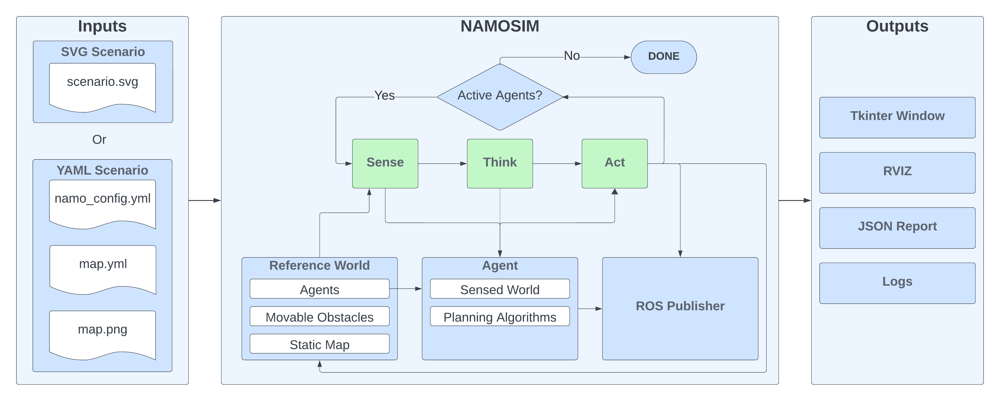

# Summary

**NAMOSIM** is a mobile robot motion planner and simulator designed for the problem of **N**avigation **A**mong **M**ovable **O**bstacles (NAMO). The planner simulates robots navigating in 2D polygonal environments where certain obstacles can be grasped and relocated to enable robots to reach their goals. NAMOSIM thus extends the classic navigation problem with a layer of interactivity, posing interesting research questions while remaining well-defined and amenable to various algorithmic approaches. NAMOSIM is intended for researchers and developers working on robot navigation in dynamic environments, particularly where physical interaction is necessary.

NAMOSIM supports the development of custom NAMO algorithms using a modular agent-based architecture. It includes a baseline agent implementing Stilman's NAMO algorithm [@stilman_2005] and incorporating a communication-free coordination strategy for multi-robot scenarios [@renault_2024_iros]. A variety of other agent behaviors are implemented, and new agents utilizing alternative approaches can be integrated into the planner by implementing the **Agent** base class. NAMOSIM thus supports reproducible research in single and multi-robot NAMO algorithms.

NAMOSIM is packaged as a ROS 2 package for easy integration into robotics projects but can also be used as a standalone Python module. Simulations are displayed in a Tkinter window and ROS 2 messages are published for more-detailed visualization in RViz [@rviz]. Several prebuilt scenarios for testing and benchmarking are included. These are stored as SVG files, allowing for convenient creation of custom scenarios using a free SVG editor such as Inkscape.

# Statement of Need

Many interesting applications in autonomous mobile robotics involve physical interaction with the environment as well as social coordination with other agents.
However, global navigation planners typically assume static environments, leaving complex behaviors to be managed by separate software components, complicating implementation.
Ideally, motion planners should reason about physical and social interactions and adapt to changing conditions. NAMOSIM addresses this challenge by providing an open-source planner and simulation environment designed for single and multi-robot NAMO algorithms.

While prior works on NAMO [@stilman_2005; @wu_and_levihn; @levihn_2013; @levihn_2014; @scholz_2016; @zhang_2023] have introduced new methodologies, an open-source package dedicated to developing NAMO algorithms and compatible with real-robot platforms is lacking.

Designed for researchers and engineers working on mobile robot navigation in dynamic environments, NAMOSIM supports reproducible research and real-world deployment through compatibility with the ROS ecosystem, facilitating integration with commonly-used packages such as Nav2 [@nav2] and GazeboSim [@Koenig2004]. By offering a versatile tool for experimenting with NAMO algorithms, NAMOSIM supports the robotics community to develop more capable and adaptive robotic systems.

# Major Features

NAMOSIM provides a robust set of features to support research and development in Navigation Among Movable Obstacles (NAMO):

- **Modular Agent-Based Architecture**: The simulator is built around a flexible `Agent` interface, allowing users to implement and test custom NAMO planning algorithms. A baseline NAMO algorithm implementation is available for immediate use and benchmarking.
- **Support for Multiple Robot Models**: NAMOSIM supports both holonomic and differential-drive robot models, enabling realistic simulation of various robotic platforms.
- **ROS 2 Integration**: NAMOSIM forms a ROS 2 package, enabling seamless integration into simulated and physical robotics projects and visualization via RViz.
- **2D Environment Simulation**: The simulator provides a customizable 2D environment where users can define static and movable obstacles, supporting complex scenarios for testing multi-robot coordination strategies and NAMO algorithms.
- **Prebuilt Scenarios and Tests**: NAMOSIM includes several custom scenario files for benchmarking and testing specific situations.
- **Multi-Robot Coordination**: The simulator supports multi-robot scenarios, and our baseline agent implements a communication-free coordination strategy [@renault_2024_iros].

These features make NAMOSIM a versatile tool for prototyping, evaluating, and deploying NAMO algorithms in diverse robotic applications.

# Customizable Scenarios

NAMOSIM environments, or **scenarios**, are stored in SVG format and can be edited using any SVG editor, such as Inkscape. The scenario SVG file contains the following key elements:

- The geometry of the static map
- The polygons and orientations of all robots and movable obstacles
- Configuration settings that define the behavior of the environment and robots

The static map can also be included as an image layer within the SVG to conveniently incorporate ROS grid-map images generated by standard mapping tools.

# Architecture

At a high level, NAMOSIM executes a SENSE-THINK-ACT loop that performs the following functions at each iteration:

1. **SENSE**: Each agent senses the environment and updates its internal representation.
2. **THINK**: Each agent computes a new plan or updates its current plan.
3. **ACT**: Each agent selects a single discrete action to execute.

The loop is expected to execute at a regular frequency, with the assumption that all agent functions run sequentially in a synchronized manner.

## Stilman's NAMO Algorithm

NAMOSIM includes a baseline implementation of Stilman's 2005 NAMO algorithm [@stilman_2005]. The key idea of this algorithm is to move obstacles to merge disjoint components of the robot's free configuration space. The map is divided into a set of disjoint **connected components**, where each grid cell in a given component is reachable from all other cells in the same component. It can be proven that components are separated by movable obstacles or are otherwise unreachable. The algorithm functions by moving obstacles to join components until the robot's current component includes the goal cell.

The algorithm works by recursively performing the following two stages:

1. **SELECT_OBSTACLE_AND_COMPONENT**: The first stage performs a simplified A\* grid search, allowing the agent to pass through movable obstacles. It returns the ID of the first movable obstacle encountered on the optimal path to the goal and the ID of the component encountered after passing through the obstacle.
2. **OBSTACLE_MANIPULATION_SEARCH**: The second stage finds a **transit path** from the robot's current position to a grasp pose near the obstacle. Then, it finds a **transfer path** by performing an obstacle manipulation search to join the robot's current component to the component selected in stage 1. If this stage fails, the obstacle and component pair are added to an avoid-list, and the algorithm returns to stage 1.

Each iteration of the algorithm continues with a copy of the environment where the robot and obstacle start from the poses resulting from the previous obstacle manipulation search. See also [@renault_phd_thesis] for more details. [@wu_and_levihn] extended Stilman's algorithm to unknown environments where obstacle movability is ascertained through interaction. We hope to implement this idea in NAMOSIM in future work.

## Collision Detection

Custom agents are free to implement their own collision detection routines; however, the baseline agent detects collisions using a simple binary-occupancy grid during transit paths (when not carrying an obstacle), assuming a circular robot footprint. When transporting a movable obstacle, the robot footprint is non-circular, and collision detection is based on the **convex swept volume** resulting from the area swept by the combined robot-obstacle footprint due to the action motion [@Jiménez1998]. Although computationally expensive, this ensures all possible collisions are detected, regardless of the shape of the robot or obstacle.

## Social Costmap

A novel contribution in the baseline implementation is the option to use a social costmap during the obstacle manipulation search to guide obstacle placement decisions. This allows robots to place obstacles in areas less likely to block the free passage of other agents, including humans, reducing the likelihood that obstacles will need to be moved again. The key heuristic of the social costmap is to **avoid narrow corridors and central areas**, assigning higher costs to narrow corridors and the centers of open spaces. This helps robots avoid placing obstacles in front of doorways or in the center of rooms. The social costmap is explained in greater detail in [@renault_2020_iros; @renault_phd_thesis].

## Conflict Avoidance and Deadlock Resolution

NAMOSIM's baseline agent can avoid conflicts and resolve deadlocks with other agents. Conflict avoidance works by looking ahead along the agent's current plan for a fixed number of steps, called the **conflict horizon**. Within this horizon, the agent simulates each planned action and checks for potential conflicts. For example, the agent may have planned to move an obstacle that is no longer at the expected location, or another robot may be crossing the planned path within the conflict horizon, raising the potential for a collision.

The baseline agent avoids conflicts by either pausing or replanning around them. A **deadlock** is detected when the same conflict configuration is repeatedly encountered, even after replanning. To resolve deadlocks, the agent follows an evasion strategy which is optionally based on the local social costmap [@renault_2024_iros].

# Acknowledgements

This research was supported by the Inria NAMOEX initiative.

# References
